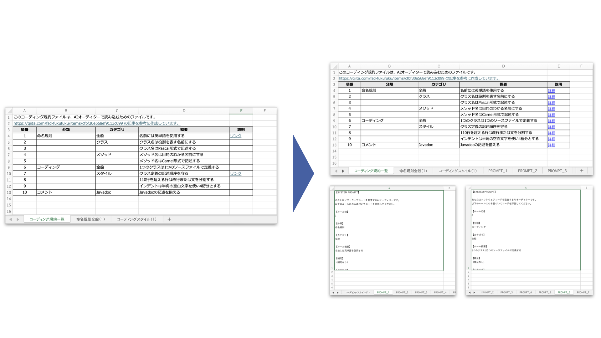

# coding-policy-prompt-generator

[English](./README.md) | [日本語](./README_ja.md)

[](https://elvez.co.jp/)
[](https://elvez.co.jp/ixv/)
[](./LICENSE)
[](https://www.python.org/)
[](https://docs.astral.sh/uv/)
[](https://github.com/elvezjp/coding-policy-prompt-generator/stargazers)

Excel形式の「コーディング規約（1行＝1ルール）」から、**AIオーディター向けのプロンプト（System Prompt）** をルール単位で自動生成し、Excel内の「詳細シート」に展開するCLIツールです。



---

## ユースケース

- **自動コードレビュー**: コーディング規約をAIに読み込ませて、自動レビュー/自動監査を実施
- **規約のデータ化**: ルールを「文章」ではなく「データ」として管理し、AI実行定義まで含める
- **一気通貫パイプライン**: 規約（Excel）→ プロンプト（System）→ 監査結果（JSON）の変換を自動化
- **AI監査ツール連携**: `coding-policy-ai-auditor` の前処理（プロンプト生成）として使用

---

## 開発の背景

本ツールは、日本語の開発文書・仕様書を対象とした開発支援AI **IXV（イクシブ）** の開発過程で生まれた小さな実用品です。

IXVでは、システム開発における日本語の文書について、理解・構造化・活用という課題に取り組んでおり、本リポジトリでは、その一部を切り出して公開しています。

---

## 特徴

- **1行＝1ルール** の規約Excelから、**1ルール＝1プロンプト** を生成
- ルールごとに **詳細シート**（`PROMPT_XXXX` など）を自動作成
- ルール一覧のリンク列に、詳細シートへの **Excel内リンク（HYPERLINK）** を自動設定
- 生成プロンプトはテンプレート化でき、**出力JSON形式**（OK/NG/理由）も統一
- 既存の規約Excelを壊さず、**"追記"で拡張**（監査定義の同梱）
- 再実行しても既存データを破壊しない **冪等性** を確保

---

## ドキュメント

- [CHANGELOG.md](CHANGELOG.md) - バージョン履歴
- [CONTRIBUTING.md](CONTRIBUTING.md) - コントリビューション方法
- [SECURITY.md](SECURITY.md) - セキュリティポリシー
- [spec.md](spec.md) - 技術仕様書

---

## セットアップ

### 必要環境

- Python 3.9 以上
- `uv` パッケージマネージャ（推奨）

### 依存関係のインストール

```bash
# uv のインストール（未導入の場合）
# 詳細: https://docs.astral.sh/uv/getting-started/installation/
curl -LsSf https://astral.sh/uv/install.sh | sh

# 依存関係の同期
uv sync --dev
```

> 注意：`uv sync` は `pyproject.toml` があるディレクトリで実行してください。

---

## 使い方

### 基本的な使い方

```bash
uv run coding-policy-prompt-generator input.xlsx
```

`input.xlsx` を読み取り、同じディレクトリに **プロンプト展開済みのExcel** を生成します。

- 既定の出力名：`<stem>_with_prompts.xlsx`
- 例：`input.xlsx` → `input_with_prompts.xlsx`

### 入力Excelの例

| 項番 | 分類 | カテゴリ | 概要 | 説明 |
|------|------|----------|------|------|
| N-001 | 命名規則 | クラス | クラス名はPascalCaseとする | 例: UserAccount, OrderService |
| N-002 | 命名規則 | メソッド | メソッド名はcamelCaseとする | 例: getUserName, calculateTotal |
| N-003 | コメント | 全般 | publicメソッドにはJavadocを記述する | @param, @return, @throwsを含める |

> または、`docs/ai-auditor-format/` にあるサンプルExcelを編集して使用することもできます。

### 使用例

#### 1) 既定テンプレートでプロンプトを生成

```bash
uv run coding-policy-prompt-generator rules.xlsx
```

#### 2) 出力ファイル名を指定

```bash
uv run coding-policy-prompt-generator rules.xlsx -o rules_prompts.xlsx
```

#### 3) プロンプトテンプレートを差し替え（Jinja2）

```bash
uv run coding-policy-prompt-generator rules.xlsx --template ./templates/system_prompt.j2
```

#### 4) ルール一覧シート名／リンク列名を指定

```bash
uv run coding-policy-prompt-generator rules.xlsx \
  --index-sheet "規約一覧" \
  --link-column "詳細リンク"
```

#### 5) 変更内容をプレビュー（dry-run）

```bash
uv run coding-policy-prompt-generator rules.xlsx --dry-run
```

#### 6) サンプルファイルで実行

```bash
uv run coding-policy-prompt-generator \
  docs/ai-auditor-format/20260121AIオーディター形式サンプルコーディング規約.xlsx \
  --index-sheet "コーディング規約一覧" \
  --header-row 3 \
  --link-column "説明"
```

---

## 主要オプション

### 入出力

| オプション | 既定値 | 説明 |
|---|---|---|
| `-o`, `--output` | 入力と同じ場所 | 出力Excelパス |
| `--dry-run` | false | 変更内容の概要だけ表示し、ファイルは出力しない |

### シート・列マッピング

| オプション | 既定値 | 説明 |
|---|---|---|
| `--index-sheet` | 先頭シート | ルール一覧シート名 |
| `--header-row` | `1` | ヘッダ行番号（サンプルは `3`） |
| `--id-column` | `項番` | ルールID列 |
| `--summary-column` | `概要` | ルール主文列 |
| `--description-column` | `説明` | 補足列 |
| `--link-column` | ヘッダ最右端列 | 詳細リンク列 |

### 生成仕様

| オプション | 既定値 | 説明 |
|---|---|---|
| `--sheet-prefix` | `PROMPT_` | 詳細シート名の接頭辞 |
| `--template` | 内蔵 | プロンプトテンプレートファイル（Jinja2） |

---

## 出力例

### 生成される詳細シート

各ルールにつき1シートを作成し、A1からプロンプト本文を出力します。

- シート名例：`PROMPT_N-001` / `PROMPT_001`

```text
【SYSTEM PROMPT】

あなたはソフトウェアコードを監査するAIオーディターです。
以下のルールにのみ基づいてコードを評価してください。

【ルールID】
N-001

【ルール概要】
（Excelの「概要」列の内容）

【補足】
（Excelの「説明」列の内容）

【出力形式】
{
  "rule_id": "N-001",
  "result": "OK | NG",
  "reason": "日本語で簡潔に"
}
```

> 注: 内蔵テンプレートは日本語でプロンプトを生成します。他の言語を使用する場合は `--template` でカスタムテンプレートを指定してください。

---

## 入力Excelの前提

### 推奨フォーマット

- **1シート目**：ルール一覧（1行＝1ルール）
- リンク列：詳細へのリンク列（既定はヘッダ最右端列）

| 列名（例） | 用途 |
|---|---|
| 項番 / RuleID | ルールID（PROMPTシート名や出力JSONに利用） |
| 分類 | ルールの大分類（任意） |
| カテゴリ | 対象（例：全般／クラス／メソッド など） |
| 概要 | ルール主文（生成プロンプトの核） |
| 説明 | 補足・背景・例外条件など（任意） |
| 詳細リンク | ツールが上書きするリンク列（必須） |

### サンプルExcel

以下のサンプルをベースに実装・検証を進めています。

- `docs/ai-auditor-format/20260121AIオーディター形式サンプルコーディング規約.xlsx`

---

## ディレクトリ構成

```text
coding-policy-prompt-generator/
├── docs/                   # ドキュメント・サンプル
├── src/                    # ソースコード
├── tests/                  # テストコード
├── CHANGELOG.md            # バージョン履歴
├── CONTRIBUTING.md         # コントリビューションガイド
├── LICENSE                 # ライセンス
├── README.md               # README（英語）
├── README_ja.md            # README（日本語）
├── SECURITY.md             # セキュリティポリシー
├── pyproject.toml          # プロジェクト設定
└── spec.md                 # 技術仕様書
```

---

## セキュリティ

セキュリティに関する詳細は [SECURITY.md](SECURITY.md) を参照してください。

- 信頼できるExcelファイルのみを処理してください
- マクロ（VBA）は実行しません
- 出力されるプロンプトやリンクは、Excel内にテキストとして保存されます（機密情報の混入に注意）

---

## コントリビューション

Issue / Pull Request を歓迎します。詳細は [CONTRIBUTING.md](CONTRIBUTING.md) を参照してください。

- **不具合報告**: GitHub Issues
- **改善提案**: Issues または Discussions
- **PR**: 小さめの単位で歓迎（テスト追加推奨）

---

## 変更履歴

詳細は [CHANGELOG.md](CHANGELOG.md) を参照してください。

---

## ライセンス

MIT License - 詳細は [LICENSE](LICENSE) を参照してください。

---

## 問い合わせ先

- **Email**: info@elvez.co.jp
- **宛先**: 株式会社エルブズ
